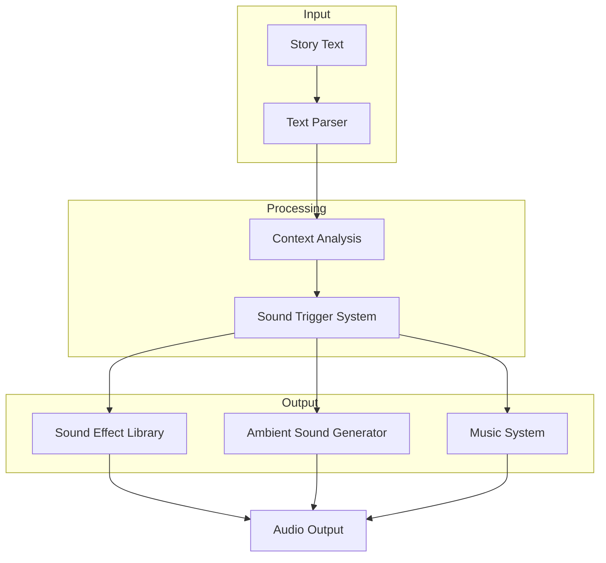
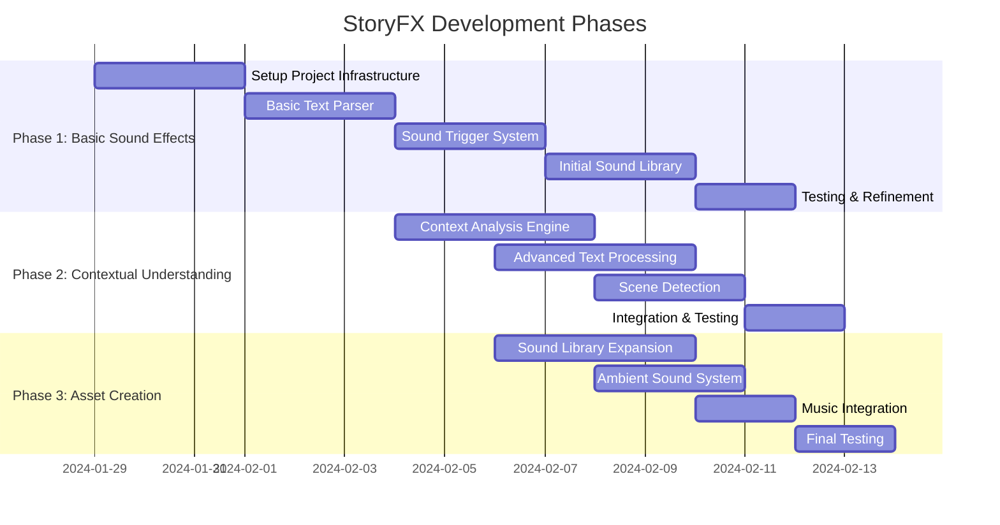

# StoryFX: Interactive Story Sound Effects

StoryFX is an innovative application that enhances storytelling by automatically triggering sound effects, ambient sounds, and music based on the story content. The system uses natural language processing to understand context and deliver immersive audio experiences.

## Features

### Current Prototype
- Text-to-sound trigger system for discrete sound effects
- Focus on animal sounds as proof of concept
- Basic text parsing and sound mapping

### Planned Features
- Ambient sound generation for scene setting
- Contextual music generation
- Advanced natural language understanding
- Rich sound effect library

## System Architecture

## Component Overview

### Text Parser
- Identifies trigger words and phrases
- Maps text to sound categories
- Analyzes sentence context

### Sound Trigger System
- Manages sound effect timing
- Handles multiple concurrent triggers
- Controls audio mixing and levels

### Sound Libraries
- Categorized sound effects
- High-quality audio assets
- Extensible library system

## Development Timeline

## Technical Implementation

### Current Prototype Components
1. Text Parser
   - Regular expression matching
   - Keyword identification
   - Basic context awareness

2. Sound Trigger System
   - Event-based architecture
   - Sound mixing capabilities
   - Timing control

3. Sound Library
   - Animal sound collection
   - Basic categorization
   - File management system

## Roadmap

### Phase 1: Basic Sound Effects
- [x] Project setup
- [x] Basic text parsing
- [x] Simple sound triggers
- [ ] Expanded sound library
- [ ] Initial testing

### Phase 2: Contextual Understanding
- [ ] Advanced text analysis
- [ ] Scene detection
- [ ] Emotion recognition
- [ ] Context-aware triggers

### Phase 3: Asset Creation and Integration
- [ ] Comprehensive sound library
- [ ] Ambient sound generation
- [ ] Musical scoring system
- [ ] Final integration

## Future Enhancements
- Real-time voice recognition for live storytelling
- Custom sound effect creation
- User sound library management
- Multi-language support
- Mobile application development
